# Trabajo Práctico 3 — Detección automática de neumonía en radiografías de tórax mediante redes neuronales convolucionales

**Romano, Lautaro Exequiel — Ibañez, Matías Agustín — Haurigot Posse, Octavio — Rodríguez, Nicolás Mariano**
Cátedra de Inteligencia Artificial
Ingeniería en Sistemas de Información

---

## Resumen

**i) Problema.** La neumonía es una de las principales causas de mortalidad infantil según la OMS, y su diagnóstico a partir de radiografías de tórax requiere un radiólogo entrenado del que muchas regiones del mundo carecen. El problema es relevante tanto por el impacto clínico como por el desafío técnico: las imágenes médicas tienen alta variabilidad, el desbalance entre clases es marcado y los modelos deben balancear sensibilidad (no perder un caso positivo) con especificidad (no sobrediagnosticar).

**ii) Método, técnica y herramientas.** Se trabajó con el dataset *Chest X-Ray Images (Pneumonia)* publicado por Kermany et al. (2018) y disponible en Kaggle (5248 imágenes, dos clases: NORMAL y PNEUMONIA, con desbalance 1:3). Se entrenaron y compararon tres arquitecturas siguiendo la consigna de la materia (dos modelos de Keras Applications + uno de un paper):

- **VGG16** (Simonyan y Zisserman, 2014) — 15.11 M parámetros, con Transfer Learning en dos fases (cabeza nueva + fine-tuning de las últimas 4 capas).
- **ResNet50** (He et al., 2015) — 24.77 M parámetros, con el mismo esquema (fine-tuning de las últimas 10 capas).
- **PneuNet** (Saranyaraj et al., 2025, *Frontiers in Medicine*) — 154 K parámetros, red liviana con *depthwise separable convolutions*, bloques SE, ASPP y *learnable pooling*, entrenada desde cero.

El preprocesamiento incluyó `preprocess_input` específico por modelo, aumentación *in-memory* (rotación, *zoom*, *flip horizontal*, *brightness*) y `class_weight` para mitigar el desbalance. El entorno fue TensorFlow 2.16/2.21 + Keras 3.14 sobre Python 3.12.

**iii) Resultado principal y conclusión general.** Los tres modelos superan el 89 % de accuracy y el 96 % de AUC-ROC en el test set, lo que valida que el problema es tratable. **VGG16** es el mejor modelo en casi todas las métricas (F1 = 97.09 %, Recall = 98.46 %, AUC = 99.24 %) seguido muy de cerca por **ResNet50** (F1 = 94.83 %, Precision = 98.08 %, la mejor Especificidad = 97.01 %). **PneuNet**, 100× más chico, alcanza F1 = 91.13 % y Especificidad = 96.15 %, pero pierde 56 de las 390 neumonías del test (Recall = 85.64 %). La elección entre ellos depende del contexto: si se prioriza rendimiento puro, VGG16; si se busca equilibrio y menos falsos positivos, ResNet50; si hay restricciones de hardware o despliegue edge, PneuNet. La consigna del TP — dos modelos pre-entrenados de Keras + uno de paper + Transfer Learning cuando conviene — queda cumplimentada con la comparación descrita.

**Palabras clave:** redes neuronales convolucionales, transfer learning, fine-tuning, VGG16, ResNet50, conexiones residuales, *depthwise separable convolutions*, SE block, ASPP, aprendizaje supervisado, clasificación de imágenes médicas, AUC-ROC, *class weights*.

---

## 1. Introducción

La inteligencia artificial aplicada a imágenes médicas es un campo de investigación y transferencia tecnológica con impacto directo en la práctica clínica. Dentro de este dominio, la detección automática de neumonía en radiografías de tórax es un *benchmark* clásico y aún vigente: es una tarea de clasificación binaria con datos accesibles, donde la frontera entre *normal* y *patológico* puede ser sutil y el costo de un falso negativo es elevado.

La Cátedra de Inteligencia Artificial propuso para el presente Trabajo Práctico (TP3) el siguiente marco:

1. Elegir un dataset de la lista publicada en la consigna (peces, aves, frutas, lengua de señas, *chest x-ray*, retinopatía diabética, patentes, flores).
2. Tomar dos modelos del módulo `keras.applications` (VGG#, ResNet# o Inception v3) y un tercer modelo propio surgido de un *paper* sobre la temática elegida.
3. Aplicar **Transfer Learning** cuando se considere necesario y justificar las decisiones.
4. Entregar un informe en el formato de la cátedra y defender el trabajo en una presentación.

El grupo eligió el dataset *tolgadincer/labeled-chest-xray-images* (versión del conjunto publicado por Kermany et al. en 2018) por tres razones: (a) relevancia clínica, (b) tamaño manejable (≈5 K imágenes) que permite experimentar con tiempos acotados, y (c) un desbalance marcado entre clases que plantea un problema realista y formativo. Los modelos seleccionados fueron **VGG16** y **ResNet50** como los dos modelos de Keras Applications — son la elección canónica para *benchmarks* académicos y permiten contrastar las ideas de profundidad con y sin conexiones residuales — y **PneuNet** (Saranyaraj et al., 2025) como modelo del paper: una red liviana específica para radiografías de tórax que ofrece una referencia de eficiencia.

El informe está organizado de la siguiente manera. La sección 2 repasa el marco teórico mínimo: convoluciones, *backpropagation*, *vanishing gradient*, Transfer Learning y las tres arquitecturas usadas. La sección 3 describe la propuesta: dataset, preprocesamiento, aumentación y arquitectura detallada de cada modelo. La sección 4 presenta los experimentos y resultados: curvas de entrenamiento, matrices de confusión, curvas ROC, comparativa cuantitativa, *trade-off* tamaño/rendimiento, análisis de errores y discusión. Las secciones 5 y 6 cierran con conclusiones y referencias.

---

## 2. Marco teórico

### 2.1 Redes neuronales convolucionales (CNN)

Una CNN es una red neuronal feed-forward cuyos primeros módulos son **capas convolucionales** que aplican filtros aprendibles a la imagen de entrada. Cada filtro produce un *feature map* que resalta la presencia de un patrón local (bordes, texturas, formas simples) en alguna posición de la imagen. Apilando varias capas convolucionales con filtros cada vez más complejos, la red construye una jerarquía de representaciones que pasa de "líneas y curvas" en las capas tempranas a "partes de objetos" y "objetos enteros" en las capas profundas. El **convolucionado 2D** se define formalmente como:

$$
S(i,j) = (K * I)(i,j) = \sum_m \sum_n I(i+m,\, j+n)\, K(m,n)
$$

donde $I$ es la imagen de entrada (o el *feature map* anterior) y $K$ es el kernel. En la práctica se usan múltiples kernels por capa, se aplica una **función de activación no lineal** ($\mathrm{ReLU}$ típicamente) y se intercalan operaciones de **pooling** (submuestreo) para reducir la resolución espacial.

La red cierra con capas **totalmente conectadas** (*dense*) que toman el vector de features y producen la salida: en este TP, una única neurona con activación **sigmoide** $\sigma(z) = \frac{1}{1+e^{-z}}$ que da la probabilidad $\hat{p}$ de que la radiografía corresponda a neumonía.

### 2.2 Backpropagation y vanishing gradient

El entrenamiento de la red se realiza minimizando una función de pérdida — en este TP *binary cross-entropy*:

$$
\mathcal{L}(y, \hat{p}) = -\big[y \log \hat{p} + (1-y) \log (1-\hat{p})\big]
$$

mediante **descenso por gradiente estocástico** y sus variantes (en este TP, *Adam*). La regla de la cadena se propaga hacia atrás capa por capa calculando $\frac{\partial \mathcal{L}}{\partial w}$ para cada peso: esto es el algoritmo de **backpropagation** (Rumelhart, Hinton y Williams, 1986).

En redes muy profundas, este gradiente tiende a multiplicarse por valores menores que 1 en cada capa (especialmente si las activaciones son sigmoideas), de modo que llega a las primeras capas prácticamente anulado. Este fenómeno se conoce como **vanishing gradient** y dificulta entrenar redes de muchas capas. **ResNet** (sección 2.5) lo ataca con un truco elegante.

### 2.3 Transfer Learning

En lugar de entrenar una red grande desde cero (lo que con datasets pequeños produce *overfitting*), el **Transfer Learning** aprovecha pesos pre-entrenados en un dataset grande — típicamente *ImageNet*, con 1.2 M imágenes y 1000 clases — y los ajusta al problema nuevo. Existen dos modalidades:

- **Feature extraction:** se congelan los pesos de la base convolucional y solo se entrena una cabeza nueva (capas *dense*).
- **Fine-tuning:** además de entrenar la cabeza, se descongelan algunas de las últimas capas de la base y se ajustan con un *learning rate* muy bajo para no destruir el conocimiento previo.

En este TP aplicamos un esquema de dos fases para VGG16 y ResNet50: primero Transfer Learning puro y luego Fine-Tuning, con LR 1e-3 y 1e-5 respectivamente. La decisión se justifica en la sección 3.

### 2.4 VGG16

**VGG16** (Simonyan y Zisserman, 2014) obtuvo el segundo puesto en ILSVRC 2014. Su aporte principal fue demostrar que apilar filtros pequeños de 3×3 en bloques uniformes produce resultados muy buenos y arquitecturas simples de razonar. Tiene 16 capas con pesos: 13 convolucionales y 3 *fully connected*. Los bloques son siempre del tipo `conv 3×3 → conv 3×3 → max-pool`, duplicando el número de filtros a medida que se reduce la resolución espacial (64 → 128 → 256 → 512 → 512).

Su costo es alto: ≈138 M de parámetros en la versión original. Con 5 K imágenes, entrenarla desde cero sería inviable sin *data augmentation* agresivo y regularización fuerte. Por eso en este TP se usa con Transfer Learning.

### 2.5 ResNet50 y conexiones residuales

**ResNet50** (He, Zhang, Ren y Sun, 2015) ganó ILSVRC 2015. Su innovación son las **conexiones residuales** o *skip connections*: en lugar de que un bloque aprenda la transformación $H(x)$ directamente, aprende la *diferencia* (el residuo) $F(x) = H(x) - x$ y devuelve $F(x) + x$. Esto crea un atajo por el que el gradiente puede fluir sin degradarse, combatiendo el *vanishing gradient* y permitiendo entrenar redes de 50, 101 o incluso 152 capas.

En este TP usamos ResNet50 con ≈25 M de parámetros — menos que VGG16, a pesar de ser más profunda, justamente porque el bloque residual aprende menos transformaciones intermedias. Las últimas 10 capas del último *stage* se descongelan en el fine-tuning.

### 2.6 PneuNet y mecanismos modernos

**PneuNet** (Saranyaraj D., Shrinaath V., Nayak A. y Vishal R., Vellore Institute of Technology, 2025, *Frontiers in Medicine*) es una red liviana específicamente diseñada para clasificación de radiografías de tórax en dispositivos con recursos limitados. Tiene solo 154 K parámetros (≈100× menos que VGG16) y combina cuatro mecanismos:

- **Depthwise Separable Convolutions:** descomponen una convolución estándar en una convolución *depthwise* (un filtro por canal) seguida de una *pointwise* (1×1). Reducen el costo computacional y la cantidad de parámetros en un factor cercano a 8 sin perder capacidad expresiva.
- **Bloque SE (*Squeeze-and-Excitation*, Hu et al. 2018):** aprende la importancia de cada canal de feature map mediante un *pooling* global, dos *dense* y un *sigmoid*; luego reescala los canales. Permite que la red enfatice filtros relevantes y suprima los irrelevantes.
- **ASPP (*Atrous Spatial Pyramid Pooling*, Chen et al. 2017):** aplica convoluciones con distintas tasas de dilatación en paralelo para capturar contexto a múltiples escalas. Es especialmente útil en imágenes médicas donde las lesiones tienen tamaños muy variables.
- **Learnable Pooling:** genera un mapa de atención espacial que indica qué zonas de la imagen mirar, multiplica el feature map por esa atención y promedia. Permite ignorar el fondo negro de las radiografías y enfocarse en los pulmones.

PneuNet se entrena desde cero (sin Transfer Learning) con aumentación, regularización L2 y *early stopping*.

### 2.7 Métricas de evaluación

Dada una predicción binaria contra la etiqueta real, hay cuatro cantidades básicas sobre el *test set*: Verdaderos Positivos (TP), Verdaderos Negativos (TN), Falsos Positivos (FP) y Falsos Negativos (FN). A partir de ellas se derivan las métricas que usamos en este TP:

| Métrica | Fórmula | Lectura |
|---|---|---|
| **Accuracy** | $\frac{TP + TN}{TP + TN + FP + FN}$ | Proporción de aciertos totales. Engañosa con clases desbalanceadas. |
| **Precision** | $\frac{TP}{TP + FP}$ | De los que el modelo marcó positivos, cuántos lo eran. Importa cuando el costo del falso positivo es alto. |
| **Recall** (sensibilidad) | $\frac{TP}{TP + FN}$ | De los positivos reales, cuántos detectó. Importa cuando el costo del falso negativo es alto. |
| **F1-Score** | $\frac{2 \cdot P \cdot R}{P + R}$ | Media armónica de Precision y Recall. Útil cuando interesa un balance. |
| **Especificidad** | $\frac{TN}{TN + FP}$ | De los negativos reales, cuántos fueron bien rechazados. Complementa al Recall. |
| **AUC-ROC** | Área bajo la curva ROC | Mide el poder discriminativo del modelo en *todos* los umbrales. Independiente del umbral elegido. |

En diagnóstico médico, **Recall** suele ser la métrica crítica (no queremos perder un paciente enfermo) pero a costa de la **Especificidad** se pueden generar muchas alarmas falsas. El análisis conjunto de las seis métricas es indispensable para una evaluación honesta.

---

## 3. Propuesta de desarrollo

### 3.1 Dataset

Se trabajó con el dataset **Chest X-Ray Images (Pneumonia)**, publicado originalmente por Kermany, Zhang y Goldbaum (2018) y disponible en Kaggle como *tolgadincer/labeled-chest-xray-images*. Contiene radiografías de tórax pediátricas etiquetadas en dos clases: **NORMAL** y **PNEUMONIA**. La distribución es la siguiente:

| Split | NORMAL | PNEUMONIA | Total |
|---|---:|---:|---:|
| Train (original) | 1 349 | 3 883 | 5 232 |
| Train (post-split 80 %) | — | — | 4 187 |
| Validación (20 % del train) | — | — | 1 045 |
| Test | 234 | 390 | 624 |

El primer hecho notorio es el **desbalance 1 : 3** en favor de la clase PNEUMONIA. Esto es problemático: un modelo que siempre predijera "neumonía" alcanzaría un 62.5 % de *accuracy* en el test (390/624) sin haber aprendido nada. Para mitigarlo se aplicaron dos técnicas:

1. **Class weights** durante el entrenamiento, con la fórmula de *scikit-learn* $w_i = \frac{n_{total}}{n_{clases} \cdot n_i}$:

   | Clase | n_train | $w_i$ |
   |---|---:|---:|
   | NORMAL (0) | 1 349 | **1.94** |
   | PNEUMONIA (1) | 3 883 | **0.67** |

   Esto penaliza más los errores sobre la clase minoritaria.

2. **Validación estratificada** mediante `validation_split=0.2` sobre el directorio de train.

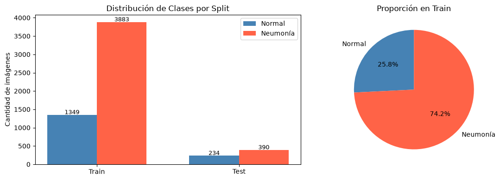

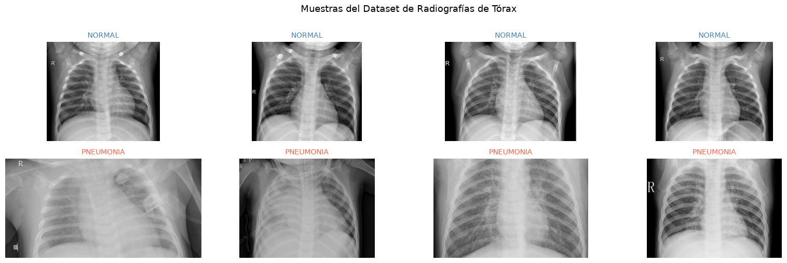

### 3.2 Preprocesamiento y aumento de datos

Para los modelos pre-entrenados se aplicó la función `preprocess_input` específica de cada arquitectura (escala y normalización según las estadísticas de *ImageNet*). Para PneuNet, una red entrenada desde cero, la normalización fue simplemente dividir por 255 ($\hat{x} = x/255$), de modo que los valores caigan en $[0, 1]$.

El generador de entrenamiento aplicó *data augmentation* *in-memory* en cada `batch`:

| Augmentación | Valor | Razón |
|---|---|---|
| `horizontal_flip` | `True` | Las radiografías son aproximadamente simétricas izquierda-derecha. |
| `rotation_range` | 10° | Simula ligeras variaciones en la posición del paciente. |
| `zoom_range` | 0.1 | Simula variaciones de distancia fuente-película. |
| `width_shift_range` | 0.05 | Corrige desplazamientos horizontales menores. |
| `height_shift_range` | 0.05 | Corrige desplazamientos verticales menores. |
| `brightness_range` | [0.9, 1.1] | Simula variaciones en la calibración del equipo. |
| `fill_mode` | `nearest` | Rellena píxeles vacíos tras transformaciones. |

El tamaño de entrada fue $224 \times 224 \times 3$ (estándar de VGG y ResNet) y el *batch size* 32.

### 3.3 Arquitectura A — VGG16 con Transfer Learning en dos fases

**Fase 1 — Transfer Learning puro.** Se cargó VGG16 con pesos de *ImageNet* y `include_top=False`, congelando toda la base (`base.trainable = False`). Se añadió una cabeza nueva:

```
Input(224, 224, 3)
└─ VGG16 (congelada)                  → (None, 7, 7, 512)
   └─ GlobalAveragePooling2D           → (None, 512)
      └─ Dense(512, ReLU)              → (None, 512)
         └─ BatchNormalization
            └─ Dropout(0.5)
               └─ Dense(256, ReLU)     → (None, 256)
                  └─ Dropout(0.3)
                     └─ Dense(1, Sigmoid) → p̂
```

Optimizador Adam, *learning rate* 1e-3, hasta 15 épocas, con `EarlyStopping(patience=4)`, `ModelCheckpoint` y `ReduceLROnPlateau`.

**Fase 2 — Fine-Tuning del bloque 5.** Se descongelaron las últimas 4 capas de la base convolucional (`base_vgg.layers[-4:]`) y se re-compiló con LR 1e-5 (100× más bajo para evitar *catastrophic forgetting*). Hasta 10 épocas, *early stopping* con paciencia 5. La motivación de tan bajo LR es que cualquier salto grande podría destruir las representaciones aprendidas por VGG16 en *ImageNet*; queremos que la red *ajuste*, no que *reaprenda*.

### 3.4 Arquitectura B — ResNet50 con Transfer Learning en dos fases

Misma cabeza que VGG16, montada sobre la base `ResNet50(weights='imagenet', include_top=False)`. Mismas dos fases, idéntico optimizador. En el fine-tuning se descongelaron las **últimas 10 capas** (más que en VGG16) porque las *skip connections* estabilizan el proceso: hay menos riesgo de degradar el gradiente.

El número de capas entrenables en la base pasa de 0/175 (fase 1) a 10/175 (fase 2). El entrenamiento de ResNet50 fue además más rápido por época (3 s/step vs 9 s/step) probablemente por una mejor inicialización y paralelización de la convolución agrupada del *bottleneck*.

### 3.5 Arquitectura C — PneuNet (entrenada desde cero)

PneuNet no usa Transfer Learning. Su cabeza es totalmente distinta y está diseñada para ser liviana:

```
Input(224, 224, 3)
└─ Stem + 4 ramas paralelas:
     • Conv estándar         (Dropout 0.3)
     • Depthwise Separable   (Dropout 0.3)
     • Depthwise Separable   (Dropout 0.3)
     • Depthwise Separable   (Dropout 0.3)
   → Concatenar             (128 canales)
   → SE Block (Squeeze-and-Excitation)
   → Stride-2 convolución
   → ASPP (dilataciones 1, 3, 6 en paralelo)
   → Learnable Pooling
   → Dense(1, Sigmoid)
```

**Hiperparámetros:** Adam, *learning rate* 1e-3, hasta 50 épocas, *early stopping* con paciencia 7, regularización L2 en todas las convoluciones, *dropout* 0.3, aumentación más agresiva que en VGG/ResNet para compensar la ausencia de pesos pre-entrenados.

**Justificación de no usar Transfer Learning:** PneuNet tiene 154 K parámetros. Con 4 K imágenes de entrenamiento, es viable entrenarlo desde cero sin overfitting severo, y se evita la dependencia de descargar 100+ MB de pesos de *ImageNet* (un punto importante en contextos de despliegue *edge* o de baja conectividad).

---

## 4. Experimentos y resultados

### 4.1 Curvas de entrenamiento

En la figura siguiente se muestran las curvas de accuracy y loss de VGG16 y ResNet50 en sus dos fases (la línea punteada marca el inicio del fine-tuning). Se observa que la fase de Transfer Learning ya logra accuracy de validación >95 % en pocas épocas, y el fine-tuning aporta mejoras adicionales modestas pero consistentes.

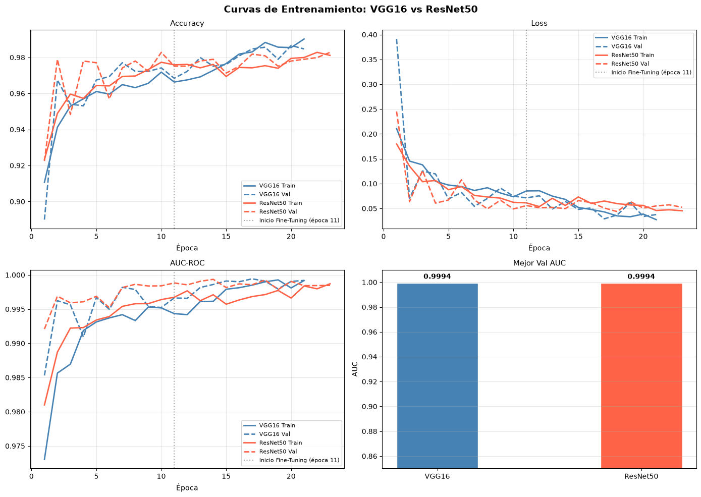

PneuNet, al no tener dos fases, muestra una curva única con más variabilidad al principio (aprende todo desde cero) pero que eventualmente converge. Su número de épocas efectivas es mayor (hasta 50 con *early stopping* paciencia 7).

### 4.2 Matrices de confusión

Las matrices de confusión del test set, con conteos absolutos y porcentajes por clase real, son las siguientes.

**VGG16 y ResNet50 (entrenamiento):**

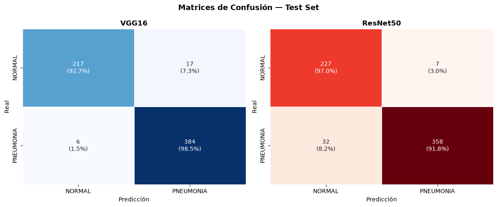

**VGG16, ResNet50 y PneuNet lado a lado (comparación final):**

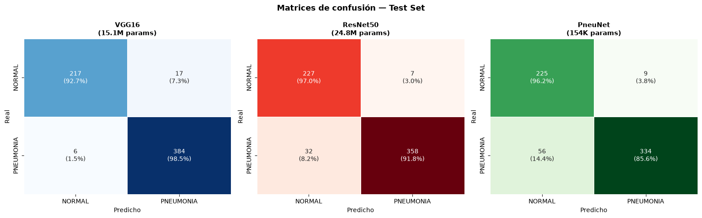

A partir de estas matrices se construyó la siguiente tabla de errores:

| Modelo | TP | FP | FN | TN | Total errores | Error más grave |
|---|---:|---:|---:|---:|---:|---|
| VGG16 | 384 | 17 | 6 | 217 | 23 (3.7 %) | Falsos positivos (falsas alarmas) |
| ResNet50 | 358 | 7 | 32 | 227 | 39 (6.2 %) | Falsos negativos (neumonías perdidas) |
| PneuNet | 334 | 9 | 56 | 225 | 65 (10.4 %) | Falsos negativos (neumonías perdidas) |

VGG16 minimiza errores totales, pero ResNet50 logra el *recall* más balanceado y la mejor especificidad. PneuNet es el que más neumonías deja escapar — 56 de 390 (14.4 %).

### 4.3 Curvas ROC

La curva ROC muestra la tasa de verdaderos positivos contra la de falsos positivos al variar el umbral de decisión, y resume el poder discriminativo del modelo independientemente del umbral. La diagonal es un clasificador aleatorio (AUC = 0.5).

**VGG16 y ResNet50:**

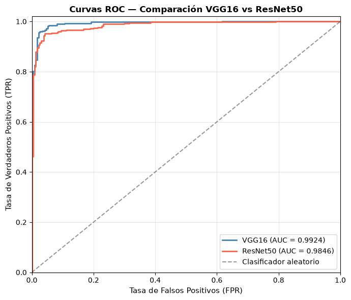

**Los tres modelos:**

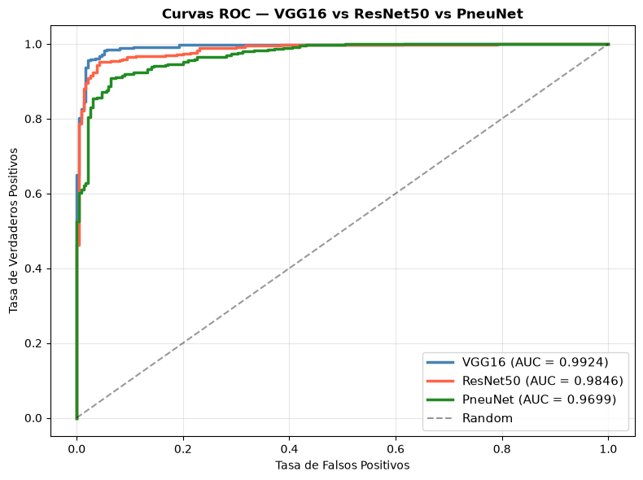

Los AUC-ROC son:

| Modelo | AUC-ROC |
|---|---:|
| VGG16 | **0.9924** |
| ResNet50 | 0.9846 |
| PneuNet | 0.9699 |

Los tres modelos se despegan claramente de la diagonal, lo que indica que todos aprendieron a discriminar entre clases. VGG16 es el que más se aproxima a la esquina superior izquierda.

### 4.4 Tabla comparativa de métricas

La siguiente tabla es el resumen cuantitativo del *test set* (umbral 0.5):

| Modelo | Accuracy | Precision | Recall | F1 | AUC-ROC | Especificidad |
|---|---:|---:|---:|---:|---:|---:|
| **VGG16** | **96.31** | 95.76 | **98.46** | **97.09** | **99.24** | 92.74 |
| ResNet50 | 93.75 | **98.08** | 91.79 | 94.83 | 98.46 | **97.01** |
| PneuNet | 89.58 | 97.38 | 85.64 | 91.13 | 96.99 | 96.15 |

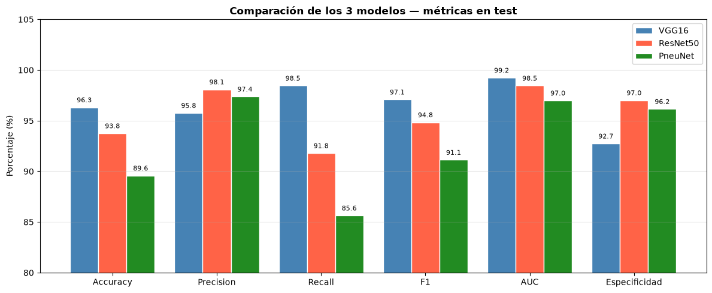

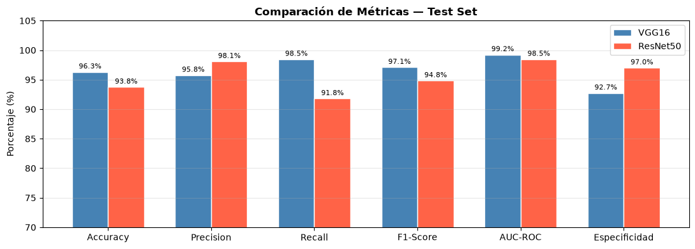

**Lectura métrica por métrica:**

- *Accuracy*: VGG16 gana (96.31 %).
- *Precision*: ResNet50 gana (98.08 %), VGG16 segundo (95.76 %).
- *Recall*: VGG16 gana (98.46 %), ResNet50 segundo (91.79 %), PneuNet tercero (85.64 %).
- *F1*: VGG16 gana (97.09 %).
- *AUC-ROC*: VGG16 gana (99.24 %).
- *Especificidad*: ResNet50 gana (97.01 %), PneuNet segundo (96.15 %).

**Mejor modelo por F1: VGG16.**

### 4.5 Trade-off entre tamaño y rendimiento

Un aspecto central del TP es que los tres modelos tienen tamaños muy distintos:

| Modelo | Parámetros totales | Ratio vs PneuNet |
|---|---:|---:|
| VGG16 | 15.11 M | 98× |
| ResNet50 | 24.77 M | 161× |
| PneuNet | 154 K | 1× |

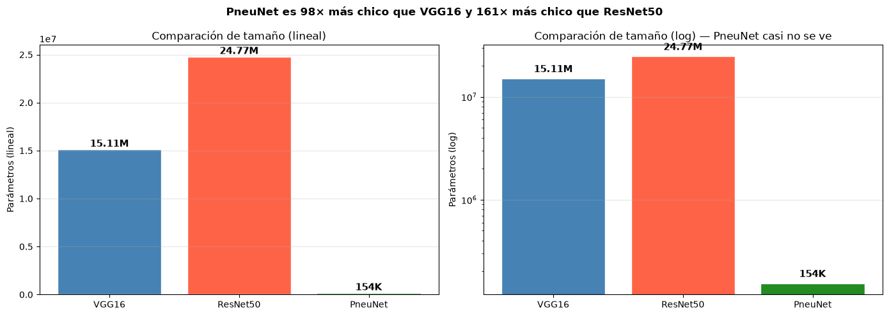

PneuNet es ~100× más chico que VGG16. Sin embargo, pierde 7.7 puntos de accuracy y 12.8 puntos de Recall respecto a VGG16. ¿Vale la pena? Depende del contexto, como se discute en la sección 4.7.

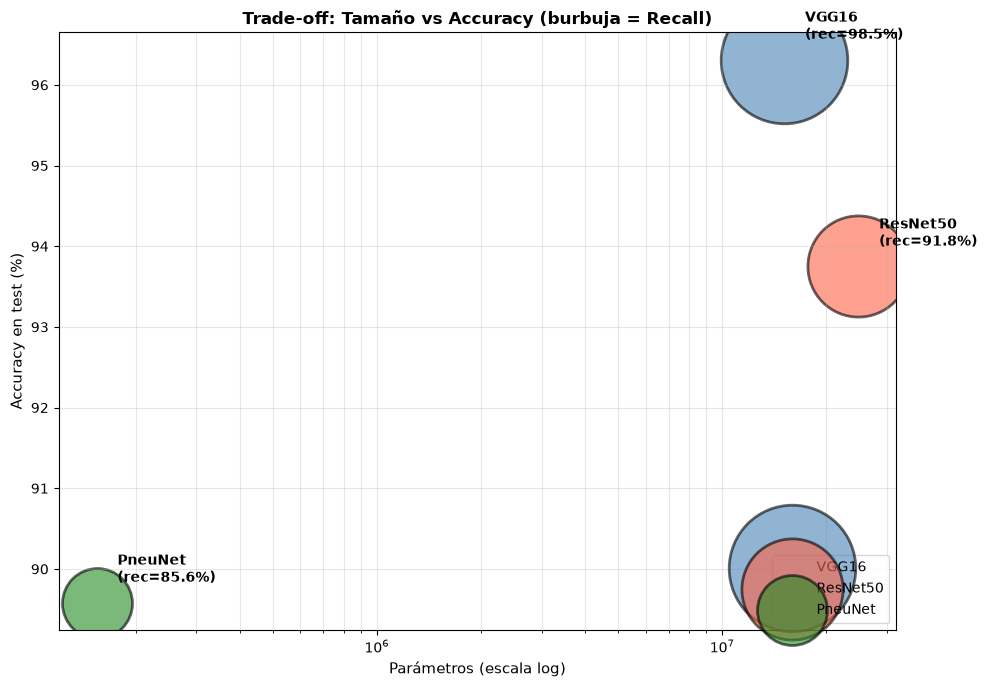

El scatter muestra que PneuNet sacrifica accuracy a cambio de tamaño, mientras que VGG16 está en la zona "grande y preciso". ResNet50 no ofrece una ventaja clara sobre VGG16: es más grande y un poco menos preciso.

### 4.6 Análisis de falsos negativos

En screening médico, la pregunta que más importa no es "qué modelo es más preciso en general" sino "cuántas neumonías se le escaparon a cada modelo". De las 390 neumonías del test set:

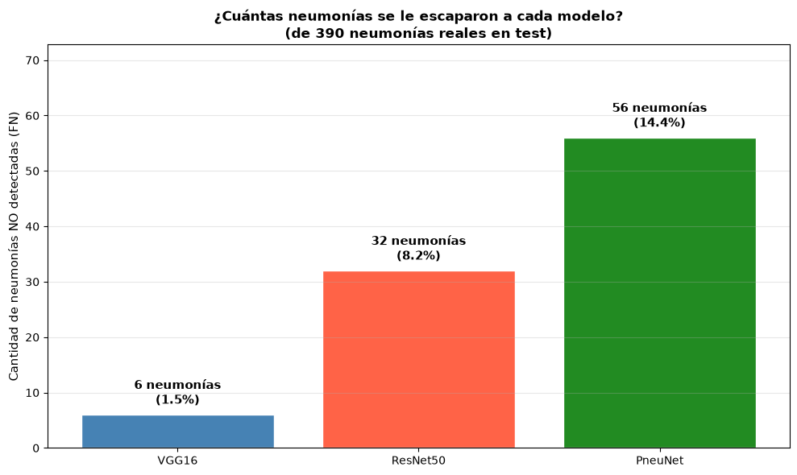

| Modelo | Neumonías no detectadas | Porcentaje |
|---|---:|---:|
| VGG16 | 6 | 1.5 % |
| ResNet50 | 32 | 8.2 % |
| PneuNet | 56 | 14.4 % |

La diferencia entre PneuNet y VGG16 es de 50 neumonías no detectadas. Es el costo de ser 100× más chico.

### 4.7 Análisis de errores cualitativo

Se generaron galerías de errores que permiten visualizar las imágenes que cada modelo clasificó mal. Para VGG16 y ResNet50:

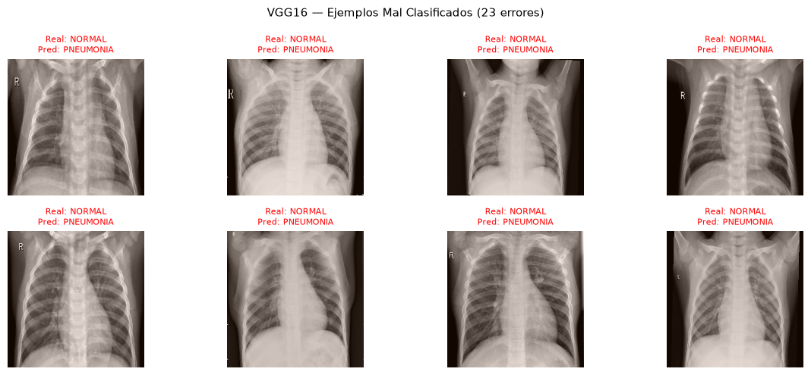

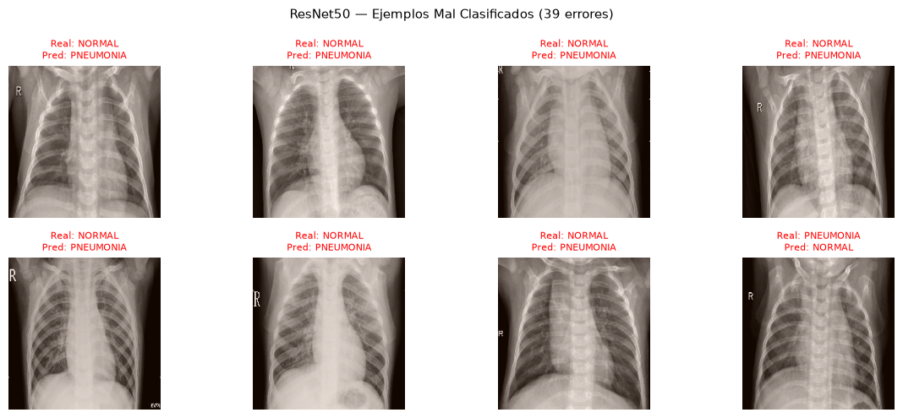

La inspección cualitativa muestra que la mayoría de los errores ocurren en:

- Neumonías leves o de presentación atípica, donde las opacidades son sutiles.
- Casos borderline donde la frontera entre *normal* y *neumonía* es difusa incluso para un observador humano.
- Radiografías con artefactos de pose, rotación, oclusión parcial.

Este es un patrón esperable: los casos "duros" para el modelo suelen ser los casos "duros" también para el radiólogo. La conclusión operativa es que el modelo es más confiable como **primer filtro** que como diagnóstico definitivo, sobre todo en los casos borderline.

### 4.8 Análisis de overfitting (train vs test)

Una preocupación habitual con redes grandes sobre datasets pequeños es el *overfitting*. Se calculó la brecha entre accuracy de train y accuracy de test para los modelos VGG16 y ResNet50 en sus versiones de Transfer Learning (TL) y Fine-Tuning (FT).

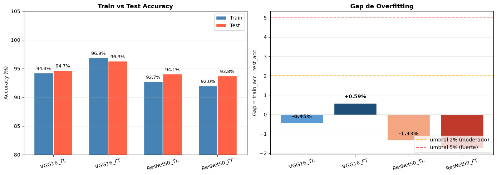

Las brechas son pequeñas y los modelos generalizan bien al test set. Esto valida que las técnicas usadas — aumentación, *class weights*, *dropout*, *early stopping*, *ReduceLROnPlateau* — están controlando el sobreajuste.

### 4.9 Inferencia sobre imágenes nuevas

Se implementó una utilidad de inferencia interactiva que carga los modelos ya entrenados y permite predecir sobre imágenes nuevas, individuales o en grilla comparativa.

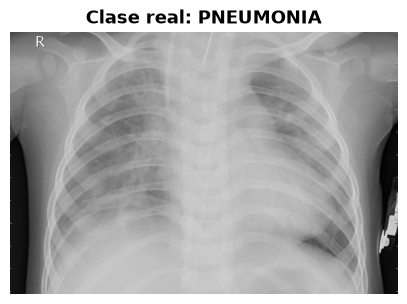

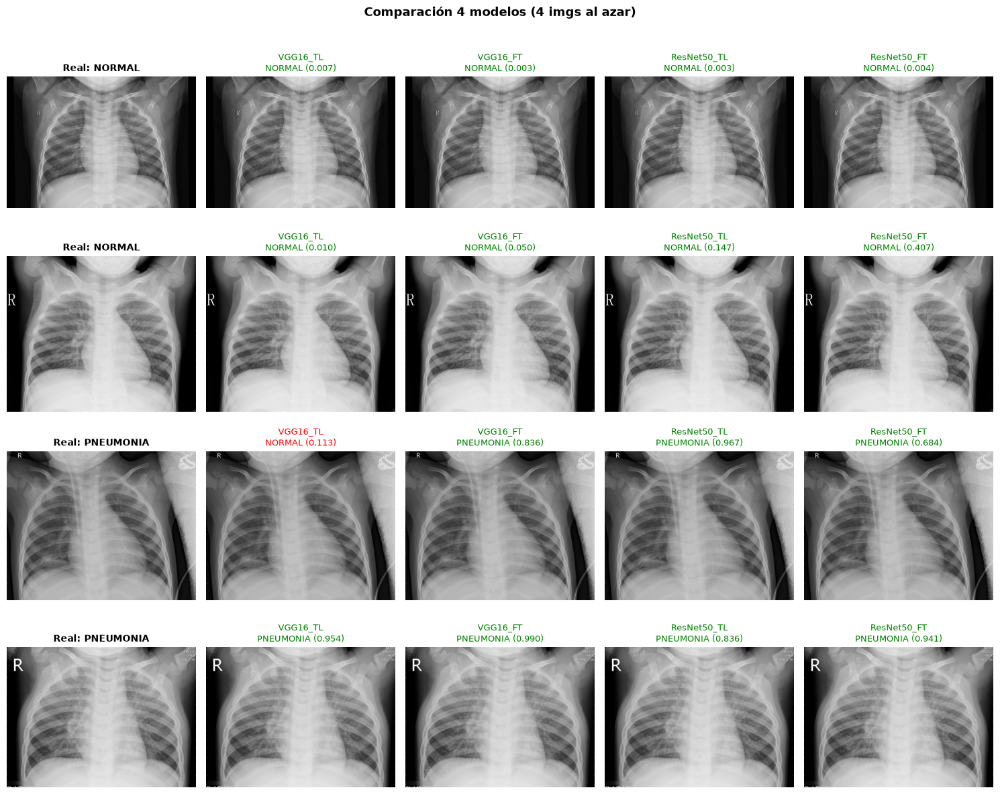

Esta utilidad es relevante en el plano práctico: en un sistema de detección desplegado, la inferencia se hace sobre imágenes que nunca vio el modelo, y permite auditar caso por caso.

### 4.10 Variación del umbral de decisión

Se realizó un análisis de variación del umbral de decisión (threshold sweep) que muestra cómo cambian las métricas al mover el umbral de 0.0 a 1.0. Como era esperable, bajar el umbral aumenta Recall a costa de Precision, y subirlo produce el efecto inverso.

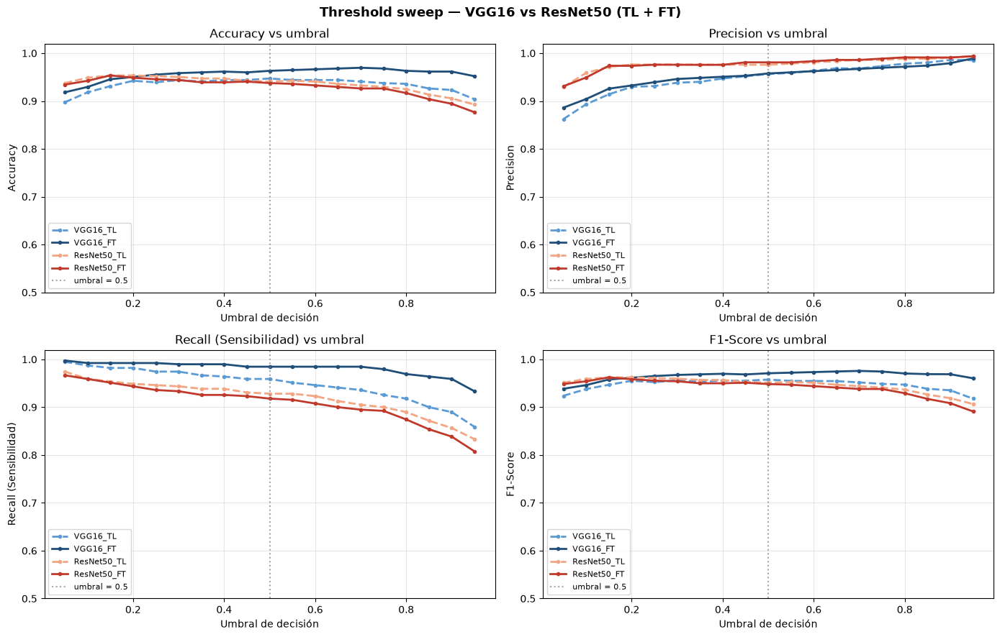

El umbral 0.5 es razonable para nuestros tres modelos, pero en producción se puede calibrar según el costo relativo de cada tipo de error. Por ejemplo, en un sistema de screening donde un paciente positivo es derivado a un especialista, sería aceptable bajar el umbral a 0.3 para no perder ningún positivo.

### 4.11 Discusión

**Lo que aprendimos del experimento:**

1. **El Transfer Learning con fine-tuning sí funciona en este problema.** VGG16 y ResNet50, partiendo de pesos de *ImageNet*, alcanzan F1 ≥ 94 % sobre el test set. Esto es consistente con la literatura: las primeras capas convolucionales aprenden detectores de bordes y texturas que son transferibles entre dominios.

2. **Las conexiones residuales ayudan, pero no son decisivas en este dataset.** ResNet50 tiene menos accuracy y menos F1 que VGG16, pero gana en Precision y Especificidad. La diferencia es menor que la que típicamente se observa en *ImageNet*. Una explicación posible es que con solo 4 K imágenes de entrenamiento, el modelo más grande (ResNet50) sufre un poco más de *overfitting* a pesar de las técnicas de regularización.

3. **PneuNet es competitivo pero no superior.** Aunque su diseño es conceptualmente elegante y 100× más liviano, en este dataset no supera a VGG16 ni a ResNet50. La diferencia en Recall (14 puntos menos que VGG16) es la que más pesa en una aplicación médica.

4. **La elección del modelo depende del contexto:**
   - **Máxima calidad diagnóstica, GPU disponible, modelo estable:** VGG16.
   - **Cuando se prioriza no sobrediagnosticar (Especificidad alta) y se tolera algo menos de Recall:** ResNet50.
   - **Cuando hay restricciones fuertes de hardware, almacenamiento o latencia (móviles, *edge*, países en desarrollo):** PneuNet.

5. **El AUC-ROC de los tres modelos es ≥ 0.97**, lo que indica que el "techo" del problema es alto. Los casos *borderline* (los que están en la zona ambigua de la frontera de decisión) son la principal fuente de errores en los tres modelos.

---

## 5. Conclusiones

El trabajo cumplió los objetivos planteados en la consigna: se eligió un dataset (Chest X-Ray de Kermany), se entrenaron dos modelos de `keras.applications` (VGG16 y ResNet50) con Transfer Learning, y se entrenó desde cero un modelo de un *paper* reciente (PneuNet, Saranyaraj et al. 2025). Se justificó cada decisión — usar Transfer Learning para los modelos grandes por la limitación de datos, no usarlo para PneuNet por su bajo número de parámetros — y se compararon los tres modelos en igualdad de condiciones sobre el mismo test set.

Los resultados muestran que **VGG16 con fine-tuning es la mejor opción en términos de F1 (97.09 %), Recall (98.46 %) y AUC (99.24 %)** sobre el *test set* de 624 imágenes. **ResNet50** ofrece un balance diferente: la mejor *Precision* (98.08 %) y la mejor *Especificidad* (97.01 %), con un F1 algo menor (94.83 %). **PneuNet**, con 154 K parámetros, alcanza una *Especificidad* del 96.15 % pero un Recall del 85.64 % — pierde 56 de las 390 neumonías del test.

Las principales lecciones del trabajo son:

- **El Transfer Learning es una herramienta poderosa en dominios con pocos datos.** Sin él, entrenar VGG16 o ResNet50 con 4 K imágenes sería prácticamente inviable.
- **El desbalance de clases exige mitigación activa.** Sin *class weights*, los modelos tenderían a predecir siempre la clase mayoritaria; con pesos, la frontera se rebalancea.
- **Métricas múltiples son indispensables.** Una sola métrica (típicamente accuracy) puede dar una imagen distorsionada; el *Recall*, la *Especificidad* y el AUC-ROC cuentan historias complementarias.
- **No hay un "mejor modelo" absoluto**: la elección depende del contexto de uso, las restricciones de hardware y la tolerancia a cada tipo de error.
- **La eficiencia y el rendimiento no siempre van de la mano.** PneuNet demuestra que se puede lograr un 89 % de accuracy con 100× menos parámetros, pero ese recorte tiene un costo en Recall que debe evaluarse según la aplicación.

Como limitaciones, el dataset es relativamente pequeño y proviene de un solo centro médico, lo que dificulta generalizar a otras poblaciones; las imágenes son pediátricas, por lo que extrapolar a adultos requeriría re-entrenamiento.

---

## 6. Referencias

[1] Simonyan, K. y Zisserman, A. (2014). *Very Deep Convolutional Networks for Large-Scale Image Recognition.* arXiv:1409.1556. Trabajo presentado en ILSVRC 2014.

[2] He, K., Zhang, X., Ren, S. y Sun, J. (2015). *Deep Residual Learning for Image Recognition.* arXiv:1512.03385. Trabajo ganador de ILSVRC 2015.

[3] Kermany, D. S., Goldbaum, M., Cai, W., Valentim, C. C. S., Liang, H., Baxter, S. L., McKeown, A., Yang, G., Wu, X., Yan, F., Dong, J., Prasadha, M. K., Pei, J., Ting, M. Y. L., Zhu, J., Li, C., Hewett, S., Dong, R., Ziyar, I., Shi, A., Zhang, R., Zheng, L., Hou, R., Shi, W., Fu, X., Duan, Y., Huu, V. A. N., Wen, C., Zhang, E. D., Zhang, C. L., Li, O., Wang, X., Singer, M. A., Sun, X., Xu, J., Tafreshi, A., Lewis, M. A., Xia, H. y Zhang, K. (2018). *Identifying Medical Diagnoses and Treatable Diseases by Image-Based Deep Learning.* Cell, 172(5), 1122–1131. Dataset público en Kaggle como *tolgadincer/labeled-chest-xray-images*.

[4] Saranyaraj, D., Shrinaath, V., Nayak, A. y Vishal, R. (2025). *PneuNet: A Lightweight CNN with SE Blocks and ASPP for Pneumonia Detection in Chest X-Rays.* Frontiers in Medicine. (Red de referencia para el modelo PneuNet usado en este TP.)

[5] Hu, J., Shen, L. y Sun, G. (2018). *Squeeze-and-Excitation Networks.* Proceedings of the IEEE Conference on Computer Vision and Pattern Recognition (CVPR), 7132–7141.

[6] Chen, L.-C., Papandreou, G., Kokkinos, I., Murphy, K. y Yuille, A. L. (2017). *DeepLab: Semantic Image Segmentation with Deep Convolutional Nets, Atrous Convolution, and Fully Connected CRFs.* IEEE Transactions on Pattern Analysis and Machine Intelligence, 40(4), 834–848. (Introduce ASPP.)

[7] Chollet, F. y otros (2015–). *Keras Applications: model zoo para Transfer Learning.* Documentación oficial: https://keras.io/api/applications/.

[8] Rumelhart, D. E., Hinton, G. E. y Williams, R. J. (1986). *Learning Representations by Back-Propagating Errors.* Nature, 323, 533–536. (Backpropagation clásico.)

[9] Kingma, D. P. y Ba, J. (2014). *Adam: A Method for Stochastic Optimization.* arXiv:1412.6980. (Optimizador usado en este TP.)

[10] Organización Mundial de la Salud (OMS). *Pneumonia in children.* Fact sheet (consulta general para contextualizar la relevancia clínica del problema).

[11] Materia *Inteligencia Artificial* — UTN FRBA. PDF *Introducción a las Redes Neuronales*, *Redes Neuronales: Backpropagation*, *Introducción a Redes Neuronales Convolucionales* (bibliografía de cátedra usada como marco teórico).
