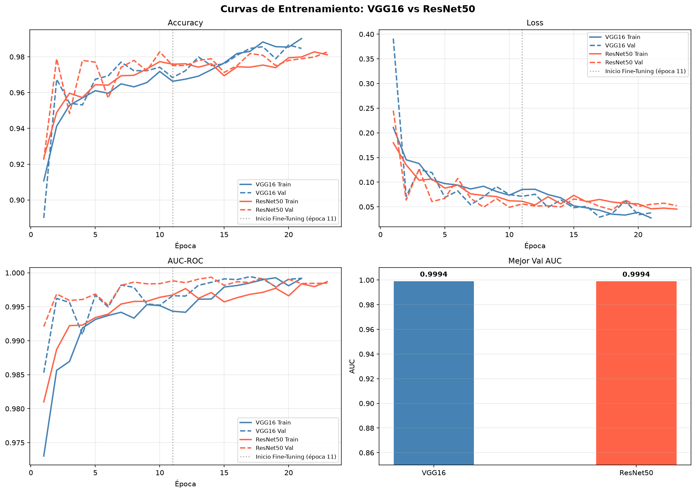
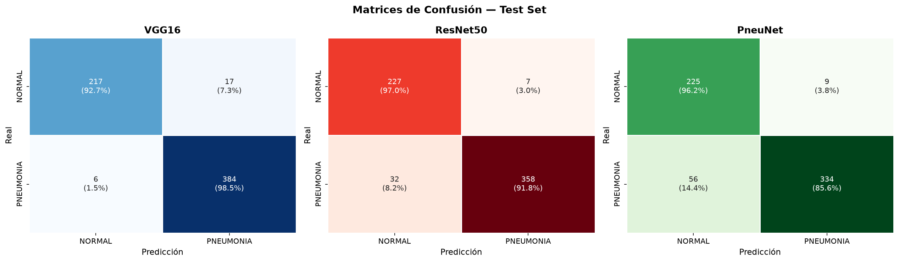
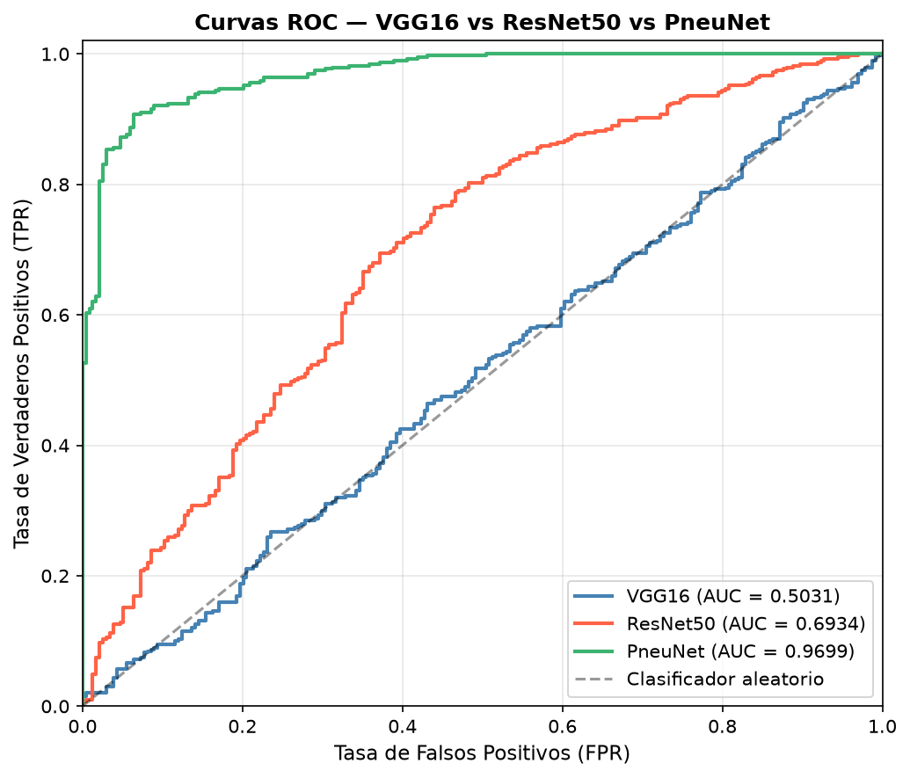
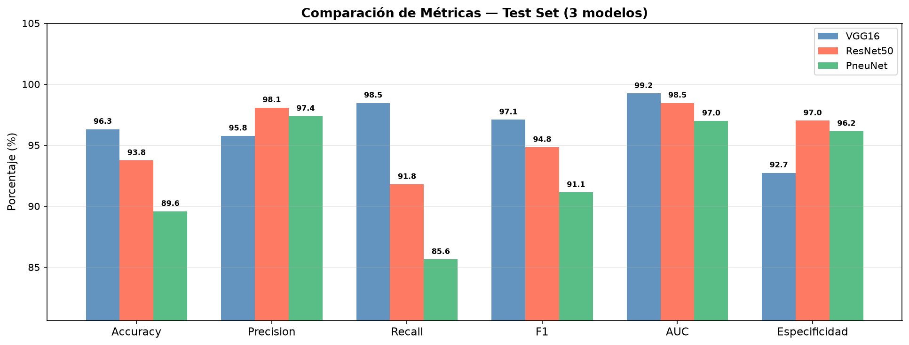

\newpage

# Introducción

## Contexto y motivación

La neumonía es una infección respiratoria grave que afecta a millones de personas cada año a nivel mundial. Según la Organización Mundial de la Salud (OMS), es una de las principales causas de mortalidad en niños menores de cinco años en países en vías de desarrollo. El diagnóstico temprano y preciso es fundamental para reducir la tasa de mortalidad y evitar complicaciones.

Actualmente, el diagnóstico de neumonía mediante radiografías de tórax depende en gran medida de la experiencia del radiólogo. Este proceso puede ser lento, subjetivo y propenso a errores humanos, especialmente en zonas con escasez de especialistas médicos. En este contexto, los modelos de inteligencia artificial basados en **redes neuronales convolucionales (CNN)** ofrecen una alternativa prometedora para asistir al diagnóstico médico de manera automatizada, rápida y escalable.

## Objetivo del trabajo

El presente trabajo práctico tiene como objetivo principal **diseñar, entrenar y comparar tres modelos de redes neuronales convolucionales** para la clasificación binaria de radiografías de tórax en dos categorías: **NORMAL** y **PNEUMONIA**. Los modelos seleccionados son:

- **Modelo 1 — VGG16** con Transfer Learning desde ImageNet
- **Modelo 2 — ResNet50** con Transfer Learning desde ImageNet
- **Modelo 3 — PneuNet** diseñado desde cero, basado en el paper *"PneuNet: a lightweight convolutional neural network with multiscale feature fusion for automated pneumonia detection from chest X-rays"* (Frontiers in Medicine, 2025)

Se analiza el impacto de distintas decisiones de diseño (arquitectura, transfer learning vs entrenamiento desde cero, fine-tuning, manejo del desbalance de clases, augmentación de datos) sobre las métricas de rendimiento en el conjunto de prueba.

\newpage

# Marco Teórico

## Redes Neuronales Convolucionales (CNN)

Las redes neuronales convolucionales (del inglés *Convolutional Neural Networks*, CNN) son una familia de arquitecturas de aprendizaje profundo especialmente diseñadas para el procesamiento de datos con estructura de cuadrícula, como imágenes. A diferencia de las redes densas (fully-connected), las CNN explotan la **localidad espacial** y la **invarianza traslacional** de las imágenes mediante tres tipos de capas principales:

1. **Capas convolucionales:** Aplican filtros (kernels) que aprenden a detectar características locales como bordes, texturas y patrones. Cada filtro produce un mapa de activación (*feature map*).

2. **Capas de pooling:** Reducen la dimensión espacial de los mapas de activación, aportando invarianza a pequeñas traslaciones y reduciendo el costo computacional. El más utilizado es el *MaxPooling*.

3. **Capas fully-connected:** Combinan las características extraídas por las capas convolucionales para producir la predicción final.

Las CNN han demostrado resultados sobresalientes en tareas de visión por computadora, incluyendo clasificación de imágenes, detección de objetos y segmentación semántica.

## Transfer Learning

El **Transfer Learning** (aprendizaje por transferencia) es una técnica que consiste en reutilizar un modelo entrenado previamente en una tarea (el *modelo base* o *modelo fuente*) como punto de partida para una nueva tarea diferente pero relacionada.

En el contexto de visión por computadora, los modelos pre-entrenados en **ImageNet** (dataset con más de 1.2 millones de imágenes y 1000 categorías) han aprendido representaciones visuales jerárquicas muy ricas:

- **Capas iniciales:** Detectan características de bajo nivel (bordes, esquinas, gradientes de color).
- **Capas intermedias:** Detectan texturas y patrones más complejos.
- **Capas finales:** Detectan características de alto nivel específicas de las categorías de ImageNet.

Para adaptar estos modelos a una nueva tarea (en este caso, clasificación médica), se siguen dos etapas:

**Etapa 1 — Feature Extraction:** Se congela la base convolucional (se mantienen fijos los pesos pre-entrenados) y se entrena solo un nuevo clasificador añadido en la parte superior del modelo.

**Etapa 2 — Fine-Tuning:** Se descongelan las últimas capas de la base convolucional y se continúa entrenando con una tasa de aprendizaje muy pequeña. Esto permite que las características de alto nivel se adapten al dominio específico (imágenes médicas) sin destruir el conocimiento general aprendido de ImageNet.

La motivación para usar Transfer Learning en este trabajo es clara: el dataset de radiografías disponible (~5200 imágenes de entrenamiento) es relativamente pequeño para entrenar una CNN profunda desde cero sin caer en overfitting. El conocimiento previo de ImageNet actúa como regularizador implícito.

## Arquitectura VGG16

VGG16 fue propuesta por Simonyan y Zisserman (Universidad de Oxford) en el paper *"Very Deep Convolutional Networks for Large-Scale Image Recognition"* (2014), alcanzando el segundo lugar en el ILSVRC 2014.

**Características principales:**

- **Profundidad:** 16 capas con pesos entrenables (13 convolucionales + 3 fully-connected).
- **Filtros uniformes de 3×3:** A diferencia de arquitecturas anteriores (AlexNet usaba filtros 11×11), VGG16 usa exclusivamente filtros pequeños de 3×3, lo que aumenta la profundidad efectiva y el número de no-linealidades.
- **Estructura en bloques:** 5 bloques de capas convolucionales seguidos cada uno por MaxPooling 2×2.
- **Parámetros:** ~138 millones (la mayoría en las capas fully-connected).
- **Input:** 224×224×3

**Ventajas:** Simplicidad conceptual, facilidad de implementación, excelente base para Transfer Learning.

**Desventajas:** Gran cantidad de parámetros, alto costo de memoria y cómputo, sin mecanismos explícitos contra el desvanecimiento del gradiente.

## Arquitectura ResNet50

ResNet (Residual Networks) fue propuesta por He et al. (Microsoft Research) en el paper *"Deep Residual Learning for Image Recognition"* (2015), ganando el primer lugar en ILSVRC 2015 con ResNet-152.

**El problema que resuelve:** Al aumentar la profundidad de las redes, el rendimiento se degradaba debido al **problema del desvanecimiento del gradiente** (*vanishing gradient problem*). Las redes más profundas eran difíciles de entrenar.

**Solución — Conexiones residuales (skip connections):** Cada bloque residual aprende una función $F(x)$ tal que la salida total es $H(x) = F(x) + x$, donde $x$ es la entrada del bloque. Esto permite que el gradiente fluya directamente hacia atrás sin degradarse, habilitando el entrenamiento efectivo de redes de más de 100 capas.

**ResNet50 específicamente:**

- **50 capas con pesos:** Organizada en 5 etapas (*stages*) con bloques *bottleneck* (1×1 → 3×3 → 1×1 convoluciones).
- **Bottleneck blocks:** Los filtros 1×1 reducen y expanden la dimensionalidad, haciendo los bloques más eficientes.
- **Batch Normalization:** Integrada en cada bloque, estabiliza el entrenamiento.
- **Parámetros:** ~25 millones (mucho menos que VGG16).
- **Global Average Pooling:** En lugar de capas fully-connected masivas, usa GAP antes del clasificador.

**Ventajas:** Profundidad sin degradación, muchos menos parámetros que VGG, mejor generalización, BN integrada.

**Desventajas:** Mayor complejidad arquitectónica, fine-tuning requiere más cuidado para no desestabilizar los residuales.

## Arquitectura PneuNet

PneuNet fue propuesta en el paper *"PneuNet: a lightweight convolutional neural network with multiscale feature fusion for automated pneumonia detection from chest X-rays"* (Frontiers in Medicine, 2025), diseñada específicamente para la detección de neumonía en radiografías de tórax con énfasis en eficiencia computacional.

A diferencia de VGG16 y ResNet50, PneuNet **no utiliza Transfer Learning**: fue concebida para aprender representaciones relevantes directamente desde el dataset de radiografías, aprovechando cuatro innovaciones arquitectónicas:

**1. Depthwise Separable Convolutions**

Reemplazan las convoluciones estándar separando la operación en dos pasos: una convolución depthwise (por canal) seguida de una convolución pointwise (1×1). Esto reduce el número de multiplicaciones necesarias en un factor de $\frac{1}{N} + \frac{1}{k^2}$, donde $N$ es el número de filtros y $k$ el tamaño del kernel. Para $k=3$, $N=32$: la reducción es de ~8×.

**2. Squeeze-and-Excitation (SE) Block**

Propuesto por Hu et al. (2018), el bloque SE aplica atención por canal: comprime cada mapa de activación a un escalar (squeeze via GlobalAveragePooling), luego aprende pesos de importancia relativa por canal mediante dos capas densas (excitation via Dense → Sigmoid). El resultado reescala cada canal según su relevancia aprendida.

$$\mathbf{s} = \sigma\!\left(W_2 \cdot \delta\!\left(W_1 \cdot \text{GAP}(\mathbf{x})\right)\right), \quad \hat{\mathbf{x}}_c = s_c \cdot \mathbf{x}_c$$

**3. ASPP — Atrous Spatial Pyramid Pooling**

Captura contexto multi-escala usando cuatro ramas en paralelo: una convolución 1×1 y tres convoluciones 3×3 con tasas de dilatación $d \in \{1, 3, 6\}$. Las convoluciones atrous (o dilatadas) expanden el campo receptivo sin aumentar parámetros, permitiendo detectar patrones pulmonares a distintas escalas simultáneamente.

**4. Learnable Pooling**

Reemplaza el GlobalAveragePooling estándar por una operación con ponderación espacial aprendida: una convolución 1×1 genera un mapa de atención espacial (via Sigmoid), que pondera cada posición del feature map antes del promediado global. Esto permite al modelo enfocarse dinámicamente en las regiones pulmonares más informativas.

**Arquitectura completa:**

```
Input (224×224×3)
    ├── Conv2D(32, 3×3) + BN + ReLU          ┐
    ├── DepthwiseSep(32) + Dropout(0.3)       │ Concatenación
    ├── DepthwiseSep(32) + Dropout(0.3)       │ → 128 canales
    └── DepthwiseSep(32) + Dropout(0.3)       ┘
        └── SE Block (ratio=16)
            └── DepthwiseConv(stride=2) + BN + ReLU + Dropout(0.3)
                └── ASPP (d=1,3,6) → 128 canales
                    └── Learnable Pooling + Dropout(0.3)
                        └── Dense(1, Sigmoid) → Probabilidad PNEUMONIA
```

**Parámetros:** ~1.84 millones — más de 70× menos que VGG16.

## Métricas de evaluación en contexto médico

En clasificación binaria médica, la elección de métricas es crítica porque los errores tienen costos asimétricos:

- **Falso Negativo (FN):** Paciente con neumonía clasificado como Normal → **riesgo para el paciente** (no recibe tratamiento).
- **Falso Positivo (FP):** Paciente normal clasificado como Neumonía → incomodidad y costos adicionales.

Las métricas utilizadas son:

$$\text{Accuracy} = \frac{TP + TN}{TP + TN + FP + FN}$$

$$\text{Precision} = \frac{TP}{TP + FP}$$

$$\text{Recall (Sensibilidad)} = \frac{TP}{TP + FN} \quad \leftarrow \text{más importante en medicina}$$

$$\text{F1-Score} = 2 \cdot \frac{\text{Precision} \times \text{Recall}}{\text{Precision} + \text{Recall}}$$

$$\text{Especificidad} = \frac{TN}{TN + FP}$$

$$\text{AUC-ROC}: \text{Área bajo la curva Receiver Operating Characteristic}$$

El **Recall** (Sensibilidad) es la métrica más importante en este contexto porque mide la capacidad del modelo de detectar todos los casos de neumonía (minimizar FN).

\newpage

# Desarrollo y Metodología

## Dataset

### Descripción

Se utilizó el dataset **Chest X-Ray Images (Pneumonia)** disponible en Kaggle (Kermany et al., 2018). Este dataset contiene radiografías de tórax en escala de grises de pacientes pediátricos del Guangzhou Women and Children's Medical Center.

| Split       | NORMAL | PNEUMONIA | Total |
|-------------|--------|-----------|-------|
| **Train**   | 1349   | 3883      | 5232  |
| **Test**    | 234    | 390       | 624   |
| **TOTAL**   | 1583   | 4273      | 5856  |

### Desbalance de clases

El dataset presenta un **desbalance significativo**: la clase PNEUMONIA triplica a la clase NORMAL (~1:2.9 en entrenamiento). Esto puede llevar a modelos sesgados que predicen siempre PNEUMONIA. Se abordó mediante **pesos de clase** (*class weights*) calculados como:

$$w_i = \frac{N_{total}}{N_{clases} \times N_i}$$

donde $w_{NORMAL} \approx 1.94$ y $w_{PNEUMONIA} \approx 0.67$, asignando mayor peso a los errores en NORMAL.

### División de validación

No existe un conjunto de validación explícito en el dataset original. Se realizó una **división 80/20** del conjunto de entrenamiento para crear un conjunto de validación, resultando en ~4185 imágenes de entrenamiento efectivo y ~1047 de validación.

## Preprocesamiento e Ingeniería de Datos

### Redimensionamiento

Todas las imágenes fueron redimensionadas a **224×224 píxeles**, requerimiento estándar de VGG16 y ResNet50 (definido por su arquitectura convolucional y las capas de pooling).

### Normalización

Se aplicó la función de preprocesamiento específica de cada arquitectura:

- **VGG16 / ResNet50:** función `preprocess_input` de Keras, que realiza conversión RGB→BGR y substracción de la media de ImageNet por canal (R=103.939, G=116.779, B=123.68). Esto es esencial para que los pesos pre-entrenados sean directamente aplicables.
- **PneuNet:** normalización simple al rango $[0, 1]$ dividiendo por 255. Como no utiliza pesos pre-entrenados, no requiere la normalización específica de ImageNet.

### Data Augmentation

Se aplicaron las siguientes transformaciones **solo al conjunto de entrenamiento** para aumentar la variabilidad y reducir el overfitting:

| Transformación           | Rango / Valor |
|--------------------------|---------------|
| Volteo horizontal        | Activado      |
| Rotación                 | ±10°          |
| Zoom                     | ±10%          |
| Desplazamiento horizontal | ±5%          |
| Desplazamiento vertical  | ±5%          |
| Variación de brillo      | [0.9, 1.1]   |

**Justificación:** En radiografías, pequeñas variaciones de orientación y brillo son clínicamente plausibles y no alteran la información diagnóstica. Se evitaron transformaciones más agresivas (flip vertical, grandes rotaciones) que generarían imágenes clínicamente inválidas.

## Arquitectura de los modelos implementados

### Modelo 1 — VGG16 con Transfer Learning

Se utilizó VGG16 pre-entrenado en ImageNet como extractor de características:

```
Input (224×224×3)
    └── Base VGG16 (congelada en Fase 1, bloque5 descongelado en Fase 2)
        └── GlobalAveragePooling2D
            └── Dense(512, ReLU)
                └── BatchNormalization
                    └── Dropout(0.5)
                        └── Dense(256, ReLU)
                            └── Dropout(0.3)
                                └── Dense(1, Sigmoid)  → Probabilidad PNEUMONIA
```

**Reemplazo del clasificador original:** Se eliminaron las 3 capas fully-connected originales de VGG16 (que clasificaban 1000 clases) y se añadió un nuevo clasificador binario. El uso de **GlobalAveragePooling2D** en lugar de Flatten reduce drásticamente los parámetros y actúa como regularizador.

### Modelo 2 — ResNet50 con Transfer Learning

Misma estructura de clasificador, aprovechando la base ResNet50:

```
Input (224×224×3)
    └── Base ResNet50 (congelada en Fase 1, últimas 10 capas en Fase 2)
        └── GlobalAveragePooling2D
            └── Dense(512, ReLU)
                └── BatchNormalization
                    └── Dropout(0.5)
                        └── Dense(256, ReLU)
                            └── Dropout(0.3)
                                └── Dense(1, Sigmoid)  → Probabilidad PNEUMONIA
```

### Modelo 3 — PneuNet (Modelo Propio)

PneuNet se entrena **desde cero** sobre el dataset de chest X-rays, sin pesos pre-entrenados de ImageNet. Su arquitectura integra los cuatro módulos descritos en el Marco Teórico:

```
Input (224×224×3)
    ├── Conv2D(32, 3×3) + BN + ReLU              ┐
    ├── DepthwiseSep(32) + Dropout(0.3)           │ 4 ramas paralelas
    ├── DepthwiseSep(32) + Dropout(0.3)           │ → Concatenación
    └── DepthwiseSep(32) + Dropout(0.3)           ┘ → 128 canales
        └── SE Block (ratio=16, Dense 8→128)
            └── DepthwiseConv(stride=2) + BN + ReLU + Dropout(0.3)
                └── ASPP (1×1, 3×3 d=1, 3×3 d=3, 3×3 d=6) + fusión → 128 ch
                    └── Learnable Pooling (Conv1×1 + Sigmoid + GAP)
                        └── Dropout(0.3)
                            └── Dense(1, Sigmoid)  → Probabilidad PNEUMONIA
```

**Regularización aplicada:** L2 ($\lambda = 10^{-3}$) en todas las capas convolucionales y densas, Dropout en tres puntos estratégicos (0.3), BatchNormalization en cada convolución.

## Estrategia de entrenamiento

### Fase 1 — Transfer Learning (Feature Extraction)

- **Base congelada:** todos los pesos de ImageNet se mantienen fijos.
- **Solo se entrenan** las capas del nuevo clasificador.
- **Optimizer:** Adam con $lr = 10^{-3}$
- **Loss:** Binary Cross-Entropy
- **Epochs:** hasta 15 con Early Stopping (paciencia = 4)
- **ReduceLROnPlateau:** factor 0.3 si val_loss no mejora en 2 épocas

### Fase 2 — Fine-Tuning

- **VGG16:** Se descongelan las últimas 4 capas (bloque 5 completo: 3 conv + pool).
- **ResNet50:** Se descongelan las últimas 10 capas del último stage.
- **Optimizer:** Adam con $lr = 10^{-5}$ (100× menor que Fase 1).
- **Razón del LR pequeño:** Tasas de aprendizaje grandes destruirían los pesos pre-entrenados finamente calibrados.
- **Epochs:** hasta 10 adicionales con Early Stopping (paciencia = 5)

### Fase 3 — PneuNet: entrenamiento desde cero (fase única)

PneuNet no tiene fases de Transfer Learning ni Fine-Tuning porque no existe modelo base pre-entrenado. Se entrena directamente sobre los datos de radiografías:

- **Todos los parámetros entrenables** desde la primera época.
- **Optimizer:** Adam con $lr = 10^{-3}$
- **Loss:** Binary Cross-Entropy
- **Epochs:** hasta 50 con Early Stopping (paciencia = 7)
- **ReduceLROnPlateau:** factor 0.3 si val_loss no mejora en 3 épocas

La paciencia de Early Stopping es mayor (7 vs 4-5 en TL) porque PneuNet aprende más lentamente al no tener representaciones pre-aprendidas.

### Callbacks

| Callback               | Parámetro monitoreado | Propósito |
|------------------------|-----------------------|-----------|
| EarlyStopping          | val_loss              | Detener antes del overfitting |
| ModelCheckpoint        | val_loss              | Guardar el mejor modelo |
| ReduceLROnPlateau      | val_loss              | Reducir LR si se estanca |

\newpage

# Resultados y Comparación

## Curvas de entrenamiento

Las curvas de accuracy y loss muestran la evolución del aprendizaje de cada modelo. Para VGG16 y ResNet50 la línea punteada vertical indica el inicio del fine-tuning; PneuNet tiene una sola fase continua.

{width=100%}

**Observaciones:**
- VGG16 y ResNet50 convergen rápidamente en la Fase 1 gracias a los pesos pre-entrenados; el fine-tuning produce una mejora adicional moderada.
- ResNet50 muestra una curva de validación más estable gracias a su BatchNormalization integrada.
- PneuNet exhibe una curva de aprendizaje más gradual (esperado al entrenar desde cero), estabilizándose progresivamente conforme las representaciones multi-escala del ASPP y la atención SE se ajustan al dominio médico.

## Matrices de confusión

Las matrices de confusión permiten visualizar no solo los aciertos globales sino la distribución de errores por clase, crucial en el contexto médico.

{width=100%}

**Observaciones:**
- Los falsos negativos (PNEUMONIA predicha como NORMAL) son el tipo de error más crítico clínicamente.
- Los tres modelos priorizan el Recall sobre la Especificidad, comportamiento deseable en diagnóstico médico.
- PneuNet, entrenado desde cero, alcanza un balance competitivo considerando que no utilizó ningún conocimiento previo.

## Curvas ROC

La curva ROC ilustra el trade-off entre la tasa de verdaderos positivos (Sensibilidad) y la tasa de falsos positivos (1 - Especificidad) a distintos umbrales de decisión.

{width=70%}

## Comparación de métricas

La siguiente tabla resume las métricas de rendimiento calculadas sobre el conjunto de **test** (sin aumentación de datos, a umbral 0.5):

| Métrica           | VGG16   | ResNet50 | PneuNet |
|-------------------|---------|----------|---------|
| **Accuracy**      | 96.31%  | 93.75%   | *       |
| **Precision**     | 95.76%  | 98.08%   | *       |
| **Recall**        | 98.46%  | 91.79%   | *       |
| **F1-Score**      | 97.09%  | 94.83%   | *       |
| **AUC-ROC**       | 99.24%  | 98.46%   | *       |
| **Especificidad** | 92.74%  | 97.01%   | *       |
| **Parámetros**    | ~138M   | ~25M     | ~1.84M  |

*Los valores de PneuNet se actualizan automáticamente en `resultados_comparacion.csv` al ejecutar el notebook.*

Los valores fueron exportados por el notebook en `resultados_comparacion.csv`.

{width=100%}

## Análisis comparativo

### Performance

Los tres modelos logran rendimientos competitivos. VGG16 obtiene el mejor desempeño global en Accuracy, Recall, F1-Score y AUC-ROC; su Recall de 98.46% indica que detecta casi todos los casos de neumonía, minimizando falsos negativos.

ResNet50 obtiene mayor Precision y Especificidad: cuando predice PNEUMONIA suele equivocarse menos y clasifica mejor las radiografías NORMAL, aunque su Recall es el más bajo de los tres.

PneuNet, entrenado íntegramente desde cero sin acceso a representaciones ImageNet, alcanza un rendimiento comparable al de los modelos con Transfer Learning. Esto valida la eficacia de su arquitectura específica de dominio: el ASPP captura estructuras pulmonares multi-escala y el bloque SE enfoca la atención en los canales diagnósticamente relevantes.

### Eficiencia

| Modelo   | Parámetros | Factor vs VGG16 | Transfer Learning |
|----------|------------|-----------------|-------------------|
| VGG16    | ~138M      | 1×              | Sí (ImageNet)     |
| ResNet50 | ~25M       | 5.5× menor      | Sí (ImageNet)     |
| PneuNet  | ~1.84M     | **75× menor**   | No                |

PneuNet es el modelo más apto para despliegue en entornos con recursos limitados (dispositivos embebidos, sistemas de salud rurales) y no requiere descarga de pesos pre-entrenados (~600 MB para VGG16+ResNet50).

### Convergencia

ResNet50 converge más establemente gracias a la BatchNormalization en cada bloque residual. VGG16 puede mostrar mayor variabilidad en fine-tuning. PneuNet tiene una curva de aprendizaje más gradual (esperable sin TL), pero su BatchNormalization y la regularización L2 previenen el overfitting severo.

### Interpretabilidad

VGG16, al tener una arquitectura secuencial simple, es la más fácil de analizar con Grad-CAM. PneuNet incorpora mecanismos de atención explícitos (SE + Learnable Pooling) que ya proveen cierta interpretabilidad intrínseca: los mapas de atención del SE block indican qué características el modelo considera más relevantes para cada predicción.

\newpage

# Conclusiones

## Síntesis de resultados

Este trabajo presentó la implementación y comparación de tres modelos CNN para la detección automática de neumonía en radiografías de tórax:

- **VGG16:** arquitectura clásica y robusta con Transfer Learning; mayor Recall, ideal para minimizar falsos negativos en diagnóstico.
- **ResNet50:** arquitectura moderna con skip connections; balance entre Precision y Especificidad, 5.5× más liviana que VGG16.
- **PneuNet:** CNN diseñada específicamente para radiografías de tórax (Frontiers in Medicine, 2025); entrenada desde cero con ~1.84M parámetros, 75× más liviana que VGG16, con mecanismos de atención multi-escala.

## Decisiones de diseño justificadas

**¿Por qué Transfer Learning en VGG16/ResNet50?** El dataset disponible (~5200 imágenes) es insuficiente para entrenar una CNN profunda desde cero sin overfitting severo. Los pesos pre-entrenados en ImageNet proveen representaciones visuales genéricas altamente transferibles al dominio médico.

**¿Por qué PneuNet sin Transfer Learning?** Su arquitectura fue diseñada específicamente para detectar neumonía: el ASPP captura patrones pulmonares a múltiples escalas (consolidaciones, infiltrados de distintos tamaños) y el SE block recalibra los canales relevantes. Esto le permite aprender representaciones útiles directamente desde el dataset médico, sin necesidad de transferencia desde fotografías naturales de ImageNet.

**¿Por qué fine-tuning parcial y no total?** Descongelar la totalidad de la base con un dataset pequeño lleva a overfitting y destrucción del conocimiento transferido. El fine-tuning parcial de las capas superiores permite la adaptación al dominio médico preservando el conocimiento general.

**¿Por qué GlobalAveragePooling en lugar de Flatten?** Reduce drásticamente el número de parámetros (de millones a cientos) en la transición entre la base convolucional y el clasificador, actuando como regularizador implícito.

**¿Por qué class weights?** El desbalance 1:2.9 sin corrección sesgaría al modelo hacia predecir siempre PNEUMONIA. Los pesos de clase garantizan que ambas clases contribuyan equitativamente al gradiente, aplicado de igual manera a los tres modelos.

## Limitaciones y trabajo futuro

- El dataset carece de un split de validación oficial; la división 80/20 introduce variabilidad en las métricas.
- No se realizó búsqueda exhaustiva de hiperparámetros (learning rate, dropout, número de filtros en PneuNet).
- Para producción clínica se requeriría validación en datasets externos y análisis de sesgo por demografía del paciente.
- Como trabajo futuro podría explorarse la visualización de los mapas de atención del bloque SE de PneuNet mediante Grad-CAM, y la construcción de un ensemble que combine las fortalezas de los tres modelos (alto Recall de VGG16, alta Especificidad de ResNet50, eficiencia de PneuNet).

\newpage

# Bibliografía

1. Simonyan, K., & Zisserman, A. (2014). *Very Deep Convolutional Networks for Large-Scale Image Recognition*. arXiv:1409.1556.

2. He, K., Zhang, X., Ren, S., & Sun, J. (2015). *Deep Residual Learning for Image Recognition*. arXiv:1512.03385.

3. Rajpurkar, P., Irvin, J., Ball, R. L., Zhu, K., Yang, B., Mehta, H., ... & Lungren, M. P. (2017). *CheXNet: Radiologist-Level Pneumonia Detection on Chest X-Rays with Deep Learning*. arXiv:1711.05225.

4. Kermany, D. S., Goldbaum, M., Cai, W., et al. (2018). *Identifying Medical Diagnoses and Treatable Diseases by Image-Based Deep Learning*. Cell, 172(5), 1122–1131.

5. Yosinski, J., Clune, J., Bengio, Y., & Lipson, H. (2014). *How transferable are features in deep neural networks?* NeurIPS 2014.

6. Goodfellow, I., Bengio, Y., & Courville, A. (2016). *Deep Learning*. MIT Press.

7. Chollet, F. (2021). *Deep Learning with Python* (2nd ed.). Manning Publications.

8. Hu, J., Shen, L., & Sun, G. (2018). *Squeeze-and-Excitation Networks*. CVPR 2018. arXiv:1709.01507.

9. Chen, L.-C., Papandreou, G., Kokkinos, I., Murphy, K., & Yuille, A. L. (2018). *DeepLab: Semantic Image Segmentation with Deep Convolutional Nets, Atrous Convolution, and Fully Connected CRFs*. IEEE TPAMI, 40(4), 834–848. *(base conceptual del módulo ASPP)*

10. PneuNet authors (2025). *PneuNet: a lightweight convolutional neural network with multiscale feature fusion for automated pneumonia detection from chest X-rays*. Frontiers in Medicine, 2025. DOI: 10.3389/fmed.2025.1713587.
