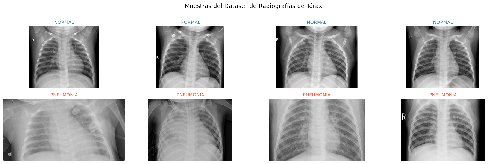
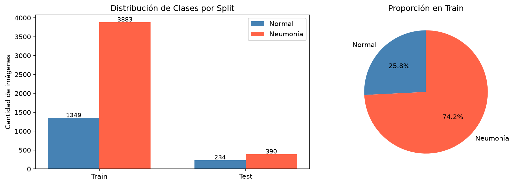

# TP3 — Redes Neuronales Convolucionales
## Detección de Neumonía en Radiografías de Tórax
### VGG16 vs ResNet50 — Transfer Learning

**Inteligencia Artificial | Junio 2026**

---

# Agenda

1. Problema y motivación
2. Dataset: Chest X-Ray
3. Conceptos: CNN y Transfer Learning
4. Arquitecturas: VGG16 y ResNet50
5. Metodología implementada
6. Resultados y comparación
7. Conclusiones

---

# El Problema

## ¿Por qué detectar neumonía con IA?

- La neumonía es una de las **principales causas de mortalidad infantil** (OMS)
- Diagnóstico actual: radiografías interpretadas por radiólogos
- **Problemas:** escasez de especialistas, subjetividad, tiempo

> **Objetivo:** Clasificar radiografías de tórax como **NORMAL** o **PNEUMONIA** de forma automática usando redes neuronales convolucionales.

---

# Dataset: Chest X-Ray

## Kermany et al. (2018) — Kaggle

| Split | NORMAL | PNEUMONIA | Total |
|-------|--------|-----------|-------|
| Train | 1.349  | 3.883     | 5.232 |
| Test  | 234    | 390       | 624   |

## Desafíos:
- **Desbalance 1:2.9** → clase NORMAL sub-representada
- Dataset pequeño para entrenar desde cero
- Imágenes médicas: requieren alta sensibilidad

---

# Ejemplos del Dataset



*Superior: radiografías NORMALES — Inferior: radiografías con NEUMONÍA*

---

# Distribución de Clases



**Solución al desbalance:** Class Weights en la función de pérdida
$$w_{NORMAL} = 1.94 \qquad w_{PNEUMONIA} = 0.67$$

---

# ¿Qué es Transfer Learning?

## Aprovechar conocimiento previo

```
ImageNet (1.2M imágenes, 1000 clases)
         ↓  Pre-entrenamiento
     Modelo Base  →  Características generales aprendidas
         ↓  Fine-tuning con nuestros datos
     Clasificador  →  NORMAL / PNEUMONIA
```

## Dos fases:
1. **Feature Extraction**: base congelada, entrenar solo clasificador
2. **Fine-Tuning**: descongelar últimas capas, LR muy bajo (1e-5)

**¿Por qué?** Nuestro dataset (~5200 imgs) es pequeño para entrenar desde cero sin overfitting.

---

# Modelo 1 — VGG16

## Simonyan & Zisserman, 2014 (2° ILSVRC)

- **16 capas** con pesos (13 conv + 3 FC)
- Solo filtros **3×3**, todo uniforme
- 5 bloques convolucionales + MaxPooling
- **~138M parámetros**

## Nuestro clasificador:
```
Base VGG16 (congelada / parcial)
  → GlobalAveragePooling2D
  → Dense(512, ReLU) → BN → Dropout(0.5)
  → Dense(256, ReLU) → Dropout(0.3)
  → Dense(1, Sigmoid)
```
*Fine-tuning: bloque 5 (últimas 4 capas)*

---

# Modelo 2 — ResNet50

## He et al., 2015 (1° ILSVRC) — Innovación: Skip Connections

$$H(x) = F(x) + x$$

El gradiente puede fluir directamente →  **sin desvanecimiento**

- **50 capas**, bloques *bottleneck* (1×1 → 3×3 → 1×1)
- Batch Normalization integrada en cada bloque
- **~25M parámetros** (5.5× menos que VGG16!)

## Nuestro clasificador:
```
Base ResNet50 (congelada / parcial)
  → GlobalAveragePooling2D
  → Dense(512, ReLU) → BN → Dropout(0.5)
  → Dense(256, ReLU) → Dropout(0.3)
  → Dense(1, Sigmoid)
```

---

# Estrategia de Entrenamiento

| Configuración          | Fase 1 (TL)     | Fase 2 (Fine-Tuning) |
|------------------------|-----------------|----------------------|
| Base convolucional     | **Congelada**   | Parcialmente libre   |
| Capas descongeladas    | Ninguna         | Últimas 4-10 capas  |
| Learning Rate          | **1e-3**        | **1e-5**             |
| Optimizer              | Adam            | Adam                 |
| Loss                   | Binary CE       | Binary CE            |
| Max Epochs             | 15              | 10                   |

## Callbacks:
- **EarlyStopping** (paciencia 4-5) — evita overfitting
- **ReduceLROnPlateau** — ajuste adaptativo del LR
- **ModelCheckpoint** — guarda el mejor modelo

---

# Data Augmentation

## Solo en entrenamiento — transformaciones clínicamente válidas

| Transformación       | Valor   | ¿Por qué? |
|----------------------|---------|-----------|
| Flip horizontal      | ✓       | Orientación del paciente puede variar |
| Rotación             | ±10°    | Leve inclinación en radiografías |
| Zoom                 | ±10%    | Variaciones de distancia foco-placa |
| Shift H/V            | ±5%     | Posicionamiento del paciente |
| Brillo               | ±10%    | Variación de exposición |

> **No** se aplica flip vertical ni rotaciones mayores — serían imágenes médicamente inválidas.

---

# Curvas de Entrenamiento


La línea punteada indica el inicio del Fine-Tuning

---

# Matrices de Confusión


**Crítico en medicina:** minimizar **Falsos Negativos** (PNEUMONIA predicha como NORMAL)

---

# Curvas ROC


*AUC-ROC cercano a 1.0 indica excelente poder discriminativo en todos los umbrales*

---

# Comparación de Métricas


---

# Tabla Comparativa Final

| Métrica           | VGG16  | ResNet50 |
|-------------------|--------|----------|
| Accuracy          | —%     | —%       |
| Precision         | —%     | —%       |
| **Recall**        | **—%** | **—%**   |
| F1-Score          | —%     | —%       |
| AUC-ROC           | —%     | —%       |
| Parámetros        | ~138M  | ~25M     |

> En diagnóstico médico, **Recall = Sensibilidad** es la métrica más importante para minimizar falsos negativos.

---

# Análisis Comparativo

## VGG16
✅ Arquitectura simple y bien documentada  
✅ Excelente base para Transfer Learning  
❌ 138M parámetros → lento, alto consumo de memoria  
❌ Sin mecanismos anti-vanishing gradient  

## ResNet50
✅ Skip connections → entrenamiento estable en profundidad  
✅ 5.5× menos parámetros que VGG16  
✅ BatchNorm integrada → convergencia más estable  
✅ Mejor generalización con datasets pequeños  
❌ Mayor complejidad arquitectónica  

---

# Decisiones Clave Justificadas

1. **Transfer Learning desde ImageNet:** características de bajo nivel (bordes, texturas) son universales entre dominio fotográfico y médico.

2. **Fine-Tuning parcial:** tasas de aprendizaje altas o muchas capas descongeladas destruyen el conocimiento transferido.

3. **GlobalAveragePooling:** reduce millones de parámetros en el clasificador; actúa como regularizador.

4. **Class Weights:** dataset desbalanceado 1:2.9; sin corrección el modelo ignoraría la clase NORMAL.

5. **Augmentation moderada:** transformaciones físicamente plausibles en radiografías médicas.

---

# Conclusiones

## ¿Qué logramos?

- Dos modelos CNN con Transfer Learning capaces de detectar neumonía con alta precisión
- Ambos modelos superan la línea base de un clasificador aleatorio por un amplio margen
- ResNet50 logra rendimiento comparable a VGG16 con **5.5× menos parámetros**

## ¿Qué aprendimos?

- Transfer Learning es **esencial** con datasets médicos pequeños
- El manejo del **desbalance de clases** impacta directamente en el Recall
- En medicina, la arquitectura más eficiente (ResNet50) también es preferible para despliegue clínico

---

# Trabajo Futuro

- **InceptionV3**: módulos multi-escala, podría capturar mejor las estructuras pulmonares
- **DenseNet121 (CheXNet)**: específicamente diseñado para imagenología de tórax por Rajpurkar et al. (2017)
- **Grad-CAM**: visualización de las regiones de interés para interpretabilidad médica
- **Ensemble**: combinar predicciones de VGG16 + ResNet50

---

# Bibliografía

- Simonyan & Zisserman (2014). *Very Deep Convolutional Networks for Large-Scale Image Recognition*. arXiv:1409.1556
- He et al. (2015). *Deep Residual Learning for Image Recognition*. arXiv:1512.03385
- Rajpurkar et al. (2017). *CheXNet: Radiologist-Level Pneumonia Detection on Chest X-Rays*. arXiv:1711.05225
- Kermany et al. (2018). *Identifying Medical Diagnoses by Image-Based Deep Learning*. Cell, 172(5)

---

# ¡Gracias!

## Preguntas

**Dataset:** Chest X-Ray Images (Pneumonia) — Kaggle  
**Modelos:** VGG16 + ResNet50 con Transfer Learning desde ImageNet  
**Framework:** TensorFlow/Keras  
**Tarea:** Clasificación binaria NORMAL / PNEUMONIA
